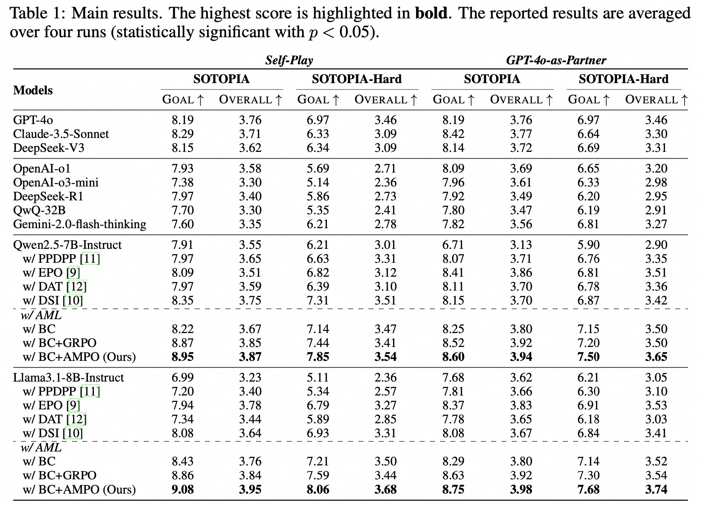

# Think on your Feet: Adaptive Thinking via Reinforcement Learning for Social Agents

<p align="center">
    
</p>

<div align="center">
<br>
<a href="https://scholar.google.com.hk/citations?user=glV21ZsAAAAJ&hl=zh-CN">Minzheng Wang</a><sup><span>1,2</span></sup>, 
<a>Yongbin Li</a><sup><span>3</span></sup>,
<a>Haobo Wang</a><sup><span>4</span></sup>,
<a href="https://xinghuazhang.top/">Xinghua Zhang</a><sup><span>3🌟</span></sup>,
<br>
<a>Nan Xu</a><sup><span>1</span></sup>,
<a>Bingli Wu</a><sup><span>3</span></sup>,
<a>Fei Huang</a><sup><span>3</span></sup>,
<a>Haiyang Yu</a><sup><span>3</span></sup>,
<a>Wenji Mao</a><sup><span>1,2🌟</span></sup>
<br>

🌟 Corresponding author

<sup>1</sup> MAIS, Institute of Automation, Chinese Academy of Sciences<br>
<sup>2</sup> School of Artificial Intelligence, University of Chinese Academy of Sciences<br>
<sup>3</sup> Tongyi Lab, Alibaba Group<br>
<sup>4</sup> Peking University<br>

<font size=3><div align='center' >  [[📖 ArXiv Paper](https://arxiv.org/pdf/2402.03300)] [[📊 Code](https://github.com/MozerWang/AMPO)] [[🏆 Models (Coming Soon)](https://huggingface.co)] [[😊 Data (Comming Soon)](https://huggingface.co/datasets/)]  </div></font>

</div>


## 👀 Overview
This repository contains code for our paper **Think on your Feet: Adaptive Thinking via Reinforcement Learning for Social Agents**. In this paper, we propose the **A**daptive **M**ode **L**earning framework (**AML**) to empower social agents with the capability for adaptive thinking, enabling them to effectively navigate and respond to the dynamics of social interaction context.
Firstly, we develop four thinking modes inspired by hierarchical cognitive control theory, covering a spectrum from non-thought, through shallow thinking, to increasingly profound levels of contemplation. Next, we perform the injection of thinking modes, which consists of behavioral cloning for learning basic modes, and RL-based adaptive thinking mode enhancement. For RL-based enhancement, we contrapuntally develop the **A**daptive **M**ode **P**olicy **O**ptimization (**AMPO**) algorithm which incorporates the mode-level and sample-level information into advantage estimation to strengthen adaptive thinking ability. In terms of reward, we design three types of reward functions, including answer reward, format reward, and answer length reward, providing feedback for choosing the appropriate thinking mode. APL finally achieves state-of-the-art performance in comparison with current open-source and closed-source advanced LLMs.
<p align="center">
    
</p>
<p align="center">
    
</p>


## 🔥 Update

- [2025.05.04]🔥AMPO is coming! We release the [paper](https://arxiv.org/pdf/2402.03300), [code](https://github.com/MozerWang/AMPO)! The data and ckpt are still under security review and will be available soon！

## 🔧How to use
**Step1** Create a conda environment and Install other dependencies.
```shell
conda create --name AMPO python=3.11 -y
conda activate AMPO
pip install -r requirements.txt
```

**Step2** Preparing the Model API

1. (**Must**) Set up your OPENAI key in config/gpt_4o.yaml (Evaluation)
```shell
api_key: "Your OPENAI key"
```

2. (**Must**) Set up your key in config/qwen2.5_72b_instruct.yaml (Reward Model)
```shell
api_key: "Your key"
# We also recommend using vLLM. And we use HTTP server that implements OpenAI’s Completions and Chat API.
# Set up your vLLM settings in config/*.yaml
```
**Step3** Behavior Cloning Training
```shell
cd BC
## (Must) Firstly set the bc_training_data_path in ./BC/data/dataset_info.yaml
sh train.sh
```

**Step4** RL Training
```shell
cd RL
## (Must) Firstly, translate the rl training data into ".parquet" format by using the script in ./RL/example/data_preprocess/sotopia.py
sh sotopia_ampo_llama3.1_8b.sh
sh sotopia_ampo_qwen2.5_7b.sh
```

**Step5** Evaluation and Inference
```shell
cd RL
sh infer.sh
## show result
python result.py --env sotopia --data_path your_result_path
```

## Acknowledgement
Thanks for these amazing work!
- [verl](https://github.com/volcengine/verl)
- [vllm](https://github.com/vllm-project/vllm)
- [llamafactory](https://github.com/hiyouga/LLaMA-Factory/)

## Citation
```
@article{wang2025ampo,
      title={Think on your Feet: Adaptive Thinking via Reinforcement Learning for Social Agents}, 
      author={Minzheng Wang and Yongbin Li and Haobo Wang and Xinghua Zhang and Nan Xu and Bingli Wu and Fei Huang and Haiyang Yu and Wenji Mao},
      year={2025},
      journal={arXiv preprint arXiv:2505.xxxxx},
      url={https://arxiv.org/abs/2505.xxxxx}
}
```